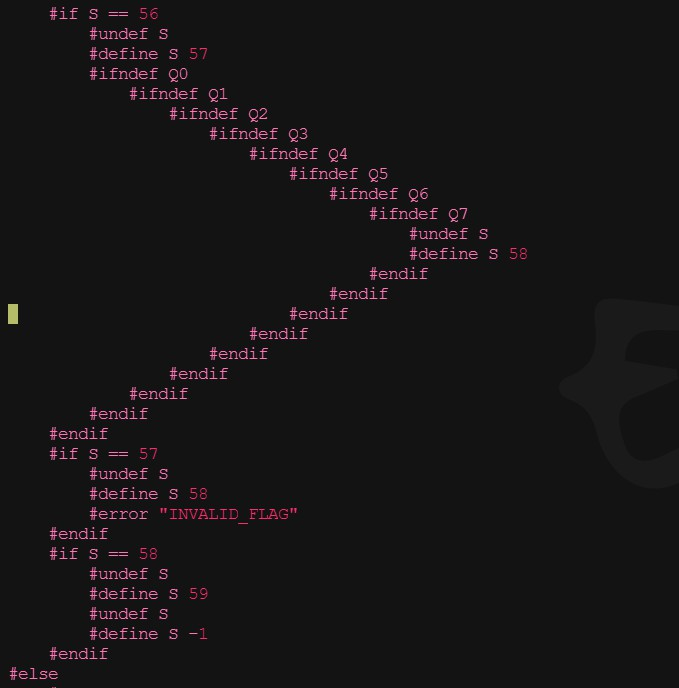
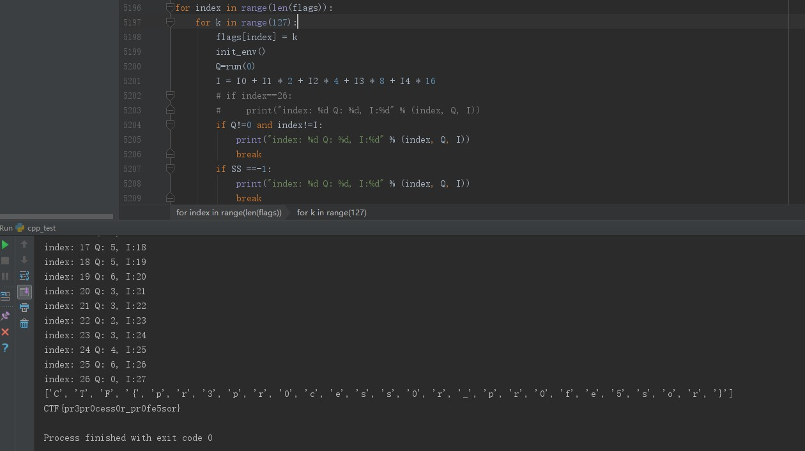
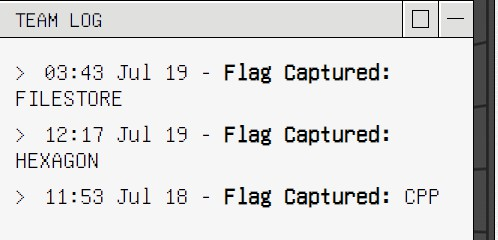

reversing题


### 1,  6000+ C 宏代码可读性差，尝试对文件增加缩进
```
    split_num = 0
    split = "    "
    while True:
        line = readfile.readline()
        if not line:
            break
        if line.startswith("#if"):
            savefile.write(split*split_num + line)
            split_num = split_num+1
        elif line.startswith("#el"):
            if split_num>=1:
                split_num = split_num -1
            savefile.write(split * split_num + line)
            split_num = split_num + 1
        elif line.startswith("#end"):
            if split_num>=1:
                split_num = split_num -1
            savefile.write(split * split_num + line)
        else:
            savefile.write(split * split_num + line)
```
缩进后发现通过宏变量S（#if S == 57） 存在58条if分支。

通过#include cpp.c, 递归调用执行if分支的内容。
```
      #if S != -1
          #include "cpp.c"
      #endif
      #if S != -1
          #include "cpp.c"
      #endif
```

尝试使用查看宏变量
```
  #define   PRINT_MACRO_HELPER(x)   #x  
  #define   PRINT_MACRO(x)   #x"="PRINT_MACRO_HELPER(x)  
  #pragma message(PRINT_MACRO(S))
```

### 2, 宏代码可调试性差，尝试将宏代码转换成python代码

requests.get请求到golang main.go时，请求变成：
  ```
 # 转换脚本：
   while True:
      line = readfile.readline()
      if not line:
          break
      if line.startswith("#if "):
          line = line[1:].strip()+":\n"
          savefile.write(split*split_num + line)
          split_num = split_num+1
      elif line.startswith("#ifdef "):
          line = "if " + line[7:].strip() + "==1:\n"
          savefile.write(split*split_num + line)
          split_num = split_num+1
      elif line.startswith("#ifndef "):
          line = "if " + line[8:].strip() + "==0:\n"
          savefile.write(split*split_num + line)
          split_num = split_num+1
      elif line.startswith("#else"):
          if split_num>=1:
              split_num = split_num -1
          line="else:\n"
          savefile.write(split * split_num + line)
          split_num = split_num + 1
      elif line.startswith("#end"):
          if split_num>=1:
              split_num = split_num -1
      elif line.startswith("#define "):
          line = line[8:].strip()
          if " " not in line:
              line = line + "=1\n"
          else:
              line = line.replace(" ", "=")
              line = line + "\n"
          savefile.write(split * split_num + line)
      elif line.startswith("#undef "):
          line= line[7:].strip()+"=0\n"
          savefile.write(split * split_num + line)
      else:
          savefile.write(split * split_num + line)
  
  # 不同语言之间的差异性， 需要手工调整一下。
 
  ```

### 3,  理解58条分支代码， 合并分支
```
  # 不同分支使用不同的全局变量A0 A1 A2 ... A7, B0 B1 B2 ... B7, C0 C1 C2 ... C7，... , Z0 Z1 Z2 ... Z7 进行if else 判定及赋值。
  #  A(A0A1A2A3A4A5A6A7),  P(P0P1P2P3P4P5P6P7)
  #  以下代码实现 A = P&(!A）        
        if SS == 51:
            SS = 52
            if P0 == 1:
                if A0 == 1:
                    A0 = 0
                else:
                    A0 = 1
            if P1 == 1:
                if A1 == 1:
                    A1 = 0
                else:
                    A1 = 1
            if P2 == 1:
                if A2 == 1:
                    A2 = 0
                else:
                    A2 = 1
            if P3 == 1:
                if A3 == 1:
                    A3 = 0
                else:
                    A3 = 1
            if P4 == 1:
                if A4 == 1:
                    A4 = 0
                else:
                    A4 = 1
            if P5 == 1:
                if A5 == 1:
                    A5 = 0
                else:
                    A5 = 1
            if P6 == 1:
                if A6 == 1:
                    A6 = 0
                else:
                    A6 = 1
            if P7 == 1:
                if A7 == 1:
                    A7 = 0
                else:
                    A7 = 1
    # 其它的分支， 通过bit位操作， 实现uint8 加 减 按位与 按位或 取反等操作
```
根据S值不同的if分支，可以进行代码合并。合并后大致可以看出代码功能：
ROM_1xxxxxx\[\]         flag字符串值， 需要破解
ROM_010xxxx\[\]         全局变量值
ROM_011XXXx\[\]         全局变量值
ROM_00xxxxx\[\]         全局变量值

分析代码，I作为读取ROM 数组索引， Q作为运算的值。 当I>=27 && Q==0 时，返回S=-1；
incluce进行多轮if执行，实现递归调用，主干代码大致如下：
   通过I读取ROM_1xxxxxx\[I\]  ROM_010xxxx\[I\]  ROM_011XXXx\[I\]  ROM_00xxxxx\[I\] 变量值
   值经过加 减 按位与 按位或 取反等操作，while操作， 计算出值A
   Q=Q|A
   I++
 最近Q需要等于0, 则要求第一轮操作Q==0


### 4， 逆向获取flag
flags\[27\]，每轮check Q值， 最终破解flag


and final, team slove 3 question

     
