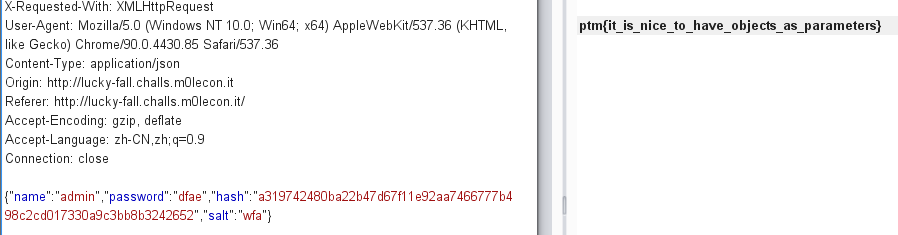

### 1,  识别到mongodb注入
请求payload为：  {“name”:"$", "password":"111"}, 返回错误
```
Traceback (most recent call last):
  File "/home/appuser/mongo_in/flask/server.py", line 38, in login
    user = users.aggregate([{"$match": {"user": request.json["name"]}}, {"$addFields": request.json}]).next()
TypeError: 'NoneType' object is not subscriptable
```
可确认pymongo sqli, 调用 users.aggregate([{"$match": {"user": request.json["name"]}}, {"$addFields": request.json}]).next() 查询db

### 2,  用户校验
请求payload返回结果不同
```
{“name”:"admin1"}
{“name”:"admin"}
```
{“name”:"admin"} 返回报错：
```
Traceback (most recent call last):
  File "/home/appuser/mongo_in/flask/server.py", line 39, in login
    if hashlib.sha256((user["password"] + user["salt"]).encode("UTF-8")).hexdigest() == user["hash"]:
KeyError: 'password'
```
猜测json未带入password时， user!=None, 但不存在“password”键值

### 3,  bypass校验
   {"$addFields": request.json} 根据request.json返回结果。
   构造password salt hash bypass check， 并获取flag


